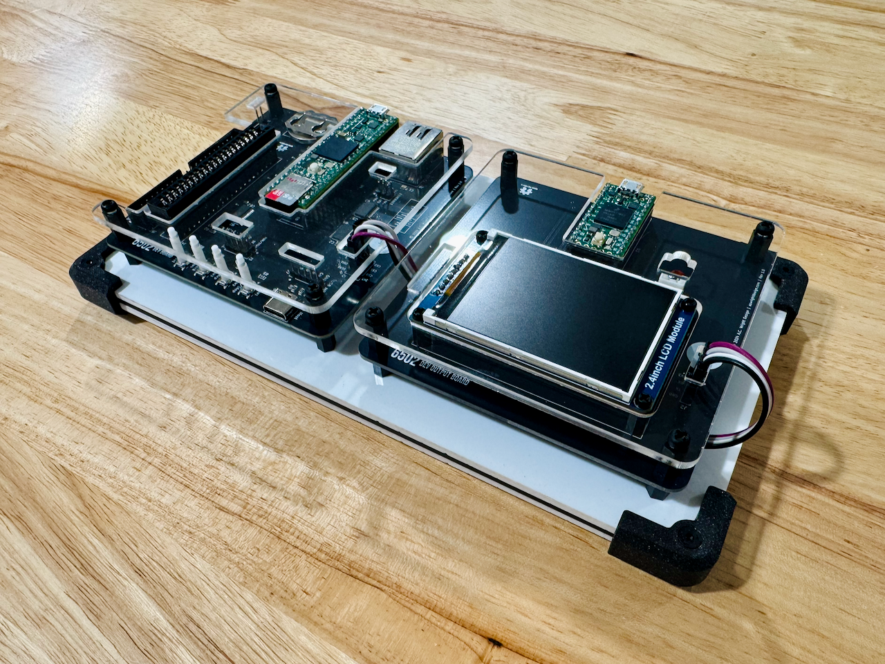

6502-DEV
========

An **AC6502** retro-style 8-bit computer based on the **65C02** microprocessor.

---

## Table of Contents

- [Overview](#overview)
- [Architecture](#architecture)
- [Systems](#systems)
- [Software](#software)
- [Hardware](#hardware)
  - [DEV Board](#dev-board)
  - [DEV Output Board](#dev-output-board)
- [Firmware](#firmware)
  - [DB Emulator](#db-emulator)
  - [DOB Display](#dob-display)
- [CAD](#cad)
- [Production](#production)
- [Schematics](#schematics)
- [Libraries](#libraries)
- [Bill of Materials](#bill-of-materials)
  - [DEV Board](#dev-board-1)
  - [DEV Output Board](#dev-output-board-1)
- [License](#license)

---

## Overview

The AC6502 ecosystem is a family of open-source, 65C02-based computers sharing a common architecture, memory map, and [BIOS](https://github.com/acwright/6502-BIOS). Each computer in the family is purpose-built for a different use case but runs the same software and firmware.

The **DEV** is an emulation-based development system. It replaces the physical 65C02 CPU with a [Teensy 4.1](https://www.pjrc.com/store/teensy41.html) running cycle-accurate 65C02 emulation via [vrEmu6502](https://github.com/visrealm/vrEmu6502).
## Architecture

All AC6502 computers share:

- **CPU**: 65C02 (or accurate emulation)
- **Memory**: 32KB RAM + 32KB ROM, with optional banked RAM expansion
- **Memory Map**: Standardized across the ecosystem — zero page, stack, I/O space ($8000–$9FFF), system ROM, and interrupt vectors at $FFFA–$FFFF
- **Bus**: 16-bit address bus, 8-bit bidirectional data bus, standard 65C02 control signals (RW, PHI2, RESET, IRQ, NMI, RDY, SYNC)
- **BIOS**: A common [BIOS](https://github.com/acwright/6502-BIOS) provides the kernel, monitor, and BASIC interpreter across all systems

## Systems

| Project | Description |
|---------|-------------|
| [6502-ACE](https://github.com/acwright/6502-ACE) | All-in-one Computer Experience — A single board computer |
| [6502-COB](https://github.com/acwright/6502-COB) | Computer On a Backplane — Modular desktop computer with expandable card slots |
| [6502-DEV](https://github.com/acwright/6502-DEV) | Development Environment Vehicle — Emulation-based dev system (YOU ARE HERE) |
| [6502-KIM](https://github.com/acwright/6502-KIM) | Keypad Input Monitor - KIM-1 inspired minimal computer |
| [6502-VCS](https://github.com/acwright/6502-VCS) | Video Computer System — Cartridge-based retro gaming console |

## Software

| Project | Description |
|---------|-------------|
| [6502-BIOS](https://github.com/acwright/6502-BIOS) | The shared BIOS (kernel, monitor, BASIC) for all AC6502 computers |
| [6502-PRG](https://github.com/acwright/6502-PRG) | Template project for writing assembly language programs |
| [6502-CRT](https://github.com/acwright/6502-CRT) | Template project for writing assembly language cartridges |
| [6502-EMULATOR](https://github.com/acwright/6502-EMULATOR) | Node.js-based AC6502 emulator |
| [6502-WEBULATOR](https://github.com/acwright/6502-WEBULATOR) | Web-based AC6502 emulator |

## Hardware

This repository contains KiCad 7.0+ PCB designs for the two boards that make up the DEV system.

### DEV Board
`Hardware/DEV Board/`

The main board hosting the Teensy 4.1. Provides 65C02 bus emulation, SD card storage, Ethernet, USB keyboard/joystick input, and hardware control buttons (Run/Stop, Step, Reset, Frequency). Includes a bus connector and card slot with level shifters for optional real hardware expansion.

### DEV Output Board
`Hardware/DEV Output Board/`

The AV output board hosting a Teensy 4.0 and a 2.4" ILI9341 TFT LCD. Emulates a TMS9918A Video Display Processor and a MOS 6581 SID audio synthesizer, driven in real time via high-speed serial from the DEV Board.

## Firmware

This repository contains [PlatformIO](https://platformio.org/)-based firmware for both boards.

### DB Emulator
`Firmware/DB Emulator/`

Firmware for the Teensy 4.1 on the DEV Board. Provides:

- Cycle-accurate 65C02 emulation
- SD card ROM/cartridge/program loading and memory snapshots
- Ethernet with mDNS (`6502.local`) and an embedded web control interface
- USB keyboard and joystick support (Xbox 360/One)
- Serial terminal interface (115200 baud)
- Hardware button control (Run/Stop, Step, Reset, Frequency)
- Variable CPU clock speed

See [Firmware/DB Emulator/README.md](./Firmware/DB%20Emulator/README.md) for setup and usage instructions.

### DOB Display
`Firmware/DOB Display/`

Firmware for the Teensy 4.0 on the DEV Output Board. Provides:

- TMS9918A VDP emulation (all four display modes, 256×192 active area)
- MOS 6581 SID audio emulation (3 voices, ADSR envelopes, PWM audio output)
- AV packet stream input at 6 Mbps over hardware UART from the DB Emulator

See [Firmware/DOB Display/README.md](./Firmware/DOB%20Display/README.md) for setup and usage instructions.

## CAD
`CAD/`

3D-printable enclosure parts and laser-cut top panels for the DEV system.

## Production
`Production/`

JLCPCB-ready Gerber files and BOM/CPL for PCB fabrication and assembly.

## Schematics
`Schematics/`

PDF schematics for each board.

## Libraries
`Libraries/`

Shared KiCad symbol and footprint libraries used across all AC6502 hardware projects.

## Bill of Materials

### DEV Board

| Reference | Qty | Value | Description | LCSC | DigiKey | Mouser | Other |
|-----------|-----|-------|-------------|------|---------|--------|-------|
| BT1 | 1 | CR2032 | Battery Holder | | [BAT-HLD-001-THM-ND](https://www.digikey.com/en/products/filter?keywords=BAT-HLD-001-THM-ND) | [712-BAT-HLD-001-THM](https://www.mouser.com/ProductDetail/712-BAT-HLD-001-THM) | |
| C1–C8 | 8 | 100nF | SMD Capacitor | [C49678](https://www.lcsc.com/search?q=C49678) | | | |
| J1 | 1 | VBAT | Pin Header 1×2 2.54mm | | | | [AMAZON](https://www.amazon.com/Straight-Breakaway-Connector-Breadboard-Electronic/dp/B0FRZW75VS) |
| J2 | 1 | SPI | Pin Header 2×4 2.54mm | | | | [AMAZON](https://www.amazon.com/Uxcell-Double-Straight-Header-Strip/dp/B00X77A472) |
| J3 | 1 | PANEL | Pin Header 2×4 2.54mm | | | | [AMAZON](https://www.amazon.com/Uxcell-Double-Straight-Header-Strip/dp/B00X77A472) |
| J4 | 1 | 6502 Card Connector | Card Edge 2×20 2.54mm | | [A31723-ND](https://www.digikey.com/en/products/filter?keywords=A31723-ND) | [571-5-5530843-4](https://www.mouser.com/ProductDetail/571-5-5530843-4) | |
| J5 | 1 | 6502 Bus | Pin Socket 2×20 2.54mm | | | | [AMAZON](https://www.amazon.com/Female-Headers-Connector-Header-Raspberry/dp/B07DNHS2SJ) |
| J6 | 1 | USB Host | USB Type-C Receptacle | [C2988369](https://www.lcsc.com/search?q=C2988369) | | | |
| J7 | 1 | USB HOST | Pin Header 1×5 2.54mm | | | | [AMAZON](https://www.amazon.com/Straight-Breakaway-Connector-Breadboard-Electronic/dp/B0FRZW75VS) |
| J8 | 1 | RJ45 w/ LEDs | RJ45 8P8C Shielded | | [1278-1052-ND](https://www.digikey.com/en/products/filter?keywords=1278-1052-ND) | | |
| J9 | 1 | ETHERNET | Pin Header 2×3 2.00mm | | | | [AMAZON](https://www.amazon.com/uxcell-2-0mm-Pitch-Double-Headers/dp/B00899WM00) |
| R1–R4 | 4 | 10kΩ | SMD Resistor | [C2930231](https://www.lcsc.com/search?q=C2930231) | | | |
| R5–R8 | 4 | 1kΩ | SMD Resistor | [C17513](https://www.lcsc.com/search?q=C17513) | | | |
| R9, R10 | 2 | 56kΩ | SMD Resistor | [C169923](https://www.lcsc.com/search?q=C169923) | | | |
| R11 | 1 | 150Ω | SMD Resistor | [C17471](https://www.lcsc.com/search?q=C17471) | | | |
| SW1 | 1 | Run/Stop | Tact Push Button | [C318884](https://www.lcsc.com/search?q=C318884) | | | |
| SW2 | 1 | Step | Tact Push Button | [C318884](https://www.lcsc.com/search?q=C318884) | | | |
| SW3 | 1 | Clock | Tact Push Button | [C318884](https://www.lcsc.com/search?q=C318884) | | | |
| SW4 | 1 | Reset | Tact Push Button | [C318884](https://www.lcsc.com/search?q=C318884) | | | |
| U1–U3, U5, U6 | 5 | SN74LVC4245APWR | Octal Bus Transceiver | [C7859](https://www.lcsc.com/search?q=C7859) | | | |
| U4 | 1 | Teensy 4.1 | Microcontroller | | | | [PJRC](https://www.pjrc.com/store/teensy41.html) |

### DEV Output Board

| Reference | Qty | Value | Description | DigiKey | Mouser | Other |
|-----------|-----|-------|-------------|---------|--------|-------|
| C1 | 1 | 3.3nF | Disc Capacitor | | | [AMAZON](https://www.amazon.com/PANMILED-Multilayer-Monolithic-Capacitors-Assortment/dp/B0CYQ1Z4G5) |
| J1 | 1 | SPEAKER | JST XH 1×2 2.50mm | [455-2247-ND](https://www.digikey.com/en/products/filter?keywords=455-2247-ND) | | |
| J2 | 1 | SERIAL | Pin Header 1×4 2.54mm | | | [AMAZON](https://www.amazon.com/Straight-Breakaway-Connector-Breadboard-Electronic/dp/B0FRZW75VS) |
| R6 | 1 | 1kΩ | Axial Resistor | [RNF18FTD1K00CT-ND](https://www.digikey.com/en/products/filter?keywords=RNF18FTD1K00CT-ND) | | [AMAZON](https://www.amazon.com/ALLECIN-8W-Metal-Film-Resistor/dp/B0C77TM3NR) |
| U1 | 1 | Waveshare LCD Header | Pin Header 1×8 2.54mm | | | [AMAZON](https://www.amazon.com/Straight-Breakaway-Connector-Breadboard-Electronic/dp/B0FRZW75VS) |
| U2 | 1 | Teensy 4.0 | Microcontroller | | | [PJRC](https://www.pjrc.com/store/teensy40.html) |
| U3 | 1 | Waveshare 2.4in LCD | 2.4" ILI9341 TFT LCD | | | [AMAZON](https://www.amazon.com/dp/B08H24H7KX) |

## License

Hardware designs are released under the [CERN Open Hardware Licence Version 2 – Permissive](https://ohwr.org/cern_ohl_p_v2.txt).  
Firmware is released under the [MIT License](./Firmware/DB%20Emulator/LICENSE).
